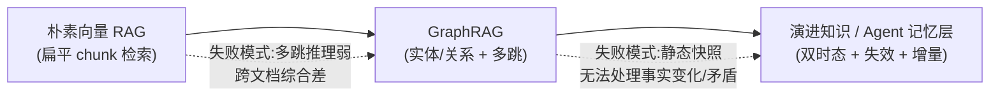
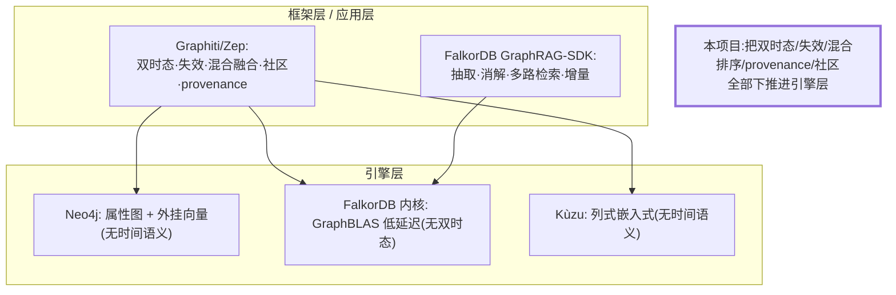
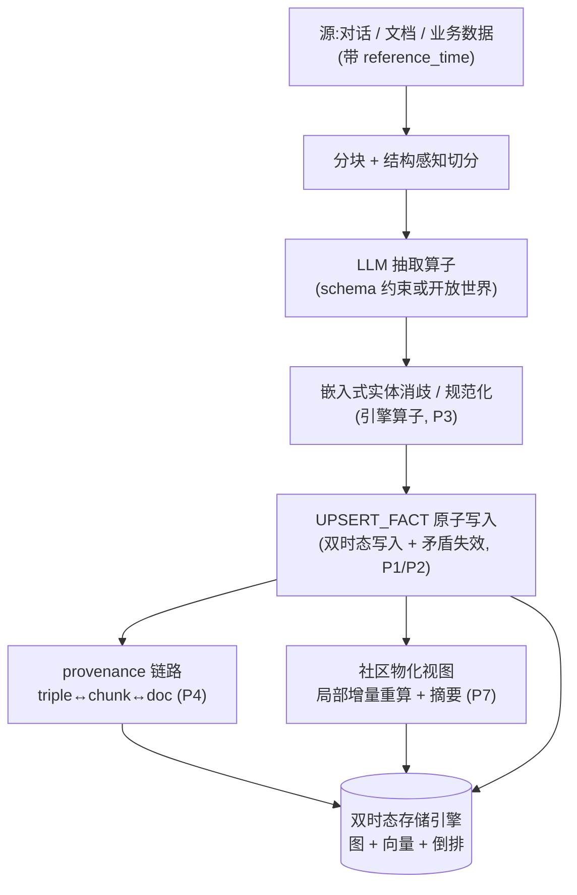
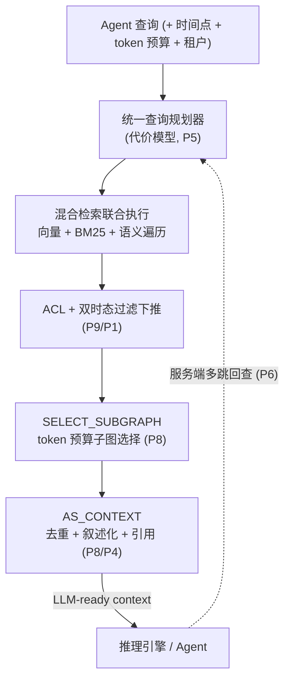
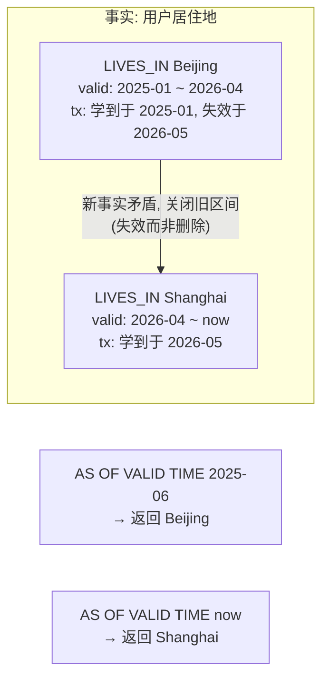

# 面向 RAG 的图数据库设计论证(路线 B:演进知识 / Agent 记忆层)

> 定位:不做"又一个通用图库",而是做一款**双时态原生(bitemporal-native)的图数据库**,把"事实有效期、事实失效与矛盾消解、混合检索、provenance、增量社区维护"作为**引擎内核的一等公民**,服务于演进知识与 Agent 长期记忆场景。
>
> 核心论点:Zep/Graphiti 已经证明了"双时态 Agent 记忆图谱"这套模型是有效的(并在 Agent 记忆评测上达到 SOTA,见 [Zep: A Temporal Knowledge Graph Architecture for Agent Memory, arXiv:2501.13956](https://arxiv.org/abs/2501.13956))。但它本质是一个**跑在通用图库之上的框架**(默认 Neo4j,也支持 FalkorDB/Kùzu)。双时态、失效、混合检索、provenance 这些能力全部在**应用层用代码堆出来**,数据库引擎对它们一无所知。这就是"做一款数据库"的真正空间:把这些能力**下推进存储与查询内核**,换取性能、一致性、可运维性的代际优势。

---

## 1. 背景与定位

### 1.1 从 RAG 到演进知识记忆层的演化



三个阶段,每一步都是为了补上一类失败模式:

- **朴素向量 RAG**:把文档切块、嵌入、按余弦相似度召回。问题:只能召回"语义相近的片段",**多跳推理弱**(A→B→C 这类需要跳转关系的问题失效),**跨文档综合差**(同一概念散落在多个文档里无法聚合)。
- **GraphRAG**:索引期用 LLM 抽实体/关系建图,检索期沿边遍历做多跳与跨文档综合。问题:产出的是**静态知识快照**。一旦事实变化(职位变动、价格调整、关系终止),旧三元组要么被覆盖丢失历史,要么与新事实共存制造矛盾。微软的 GraphRAG 是批处理流水线,更新基本要全量重算。
- **演进知识 / Agent 记忆层**:把"时间"和"事实生命周期"纳入模型。每条事实带有效期;新事实到来时,旧的矛盾事实被**失效(invalidate)而非删除**,从而支持"某时间点的世界视图"查询与矛盾消解。这正是 Agent 长期记忆的刚需——Agent 必须知道"用户上个月说住在北京,这个月说搬到了上海",且能区分"现在的事实"与"历史的事实"。

### 1.2 为什么静态知识图谱不够

Agent 记忆与企业演进知识有三个静态 KG 无法满足的特征:

1. **事实有时效**:大多数事实不是永恒为真,而是"在某段时间内为真"。静态 KG 只有一个隐式时间戳(入库时间),无法表达"valid from / valid to"。
2. **信息会迟到与矛盾**:对话里常出现"上周三我离职了"这种**迟到信息**(事件发生在过去,系统现在才得知)。还会出现新信息与旧信息直接矛盾。静态 KG 无法优雅处理。
3. **必须增量、低延迟**:Agent 在交互过程中实时写入记忆、实时检索。批处理重算(GraphRAG 那套)在这里完全不可行。

### 1.3 本文档的范围

本文档聚焦"路线 B"的**数据库引擎设计论证**,包含:痛点清单、竞品分层对标、引擎级架构创新、架构图、技术选型论证、与 Graphiti 的能力边界、风险与里程碑。**不含具体代码实现**,作为立项与架构评审材料。

---

## 2. 痛点清单(聚焦演进知识 / Agent 记忆层)

下面每条痛点都标注:**现有方案在哪一层解决**、**缺口在哪**。这是判断"值不值得做成数据库"的关键——凡是当前只能在应用层/框架层硬堆、且能从引擎下推中获益的,就是我们的机会。

### P1. 双时态与矛盾消解

- 需求:同时跟踪 **valid time(事实在现实世界何时为真)** 与 **transaction time(系统何时获知)**;新事实矛盾旧事实时自动失效旧事实并保留历史。
- 现状:Graphiti 在**框架层**用 Python 逻辑实现了这套双时态模型与失效(每条边带 `valid_at` / `invalid_at` / `created_at` / `expired_at`)。Neo4j / 通用图库**引擎层完全不感知**时间语义——双时态全靠应用代码维护属性 + 手写过滤条件。
- 缺口:**没有引擎把双时态作为一等存储与索引维度**。导致:point-in-time 查询要在遍历后用属性过滤(慢且无专用索引)、失效需要应用层先查后写(竞态/一致性风险)、历史版本无原生压缩与冷热分层。

### P2. 增量构建成本(索引期 LLM 抽取)

- 需求:新数据进来即时融入图,**不做全量重算**。
- 现状:FalkorDB GraphRAG-SDK 的 `apply_changes()` 在**框架层**做"增量合并 + crash-safe rollforward 切换";Graphiti 也强调 real-time incremental。微软 GraphRAG 是批处理,基本无增量。
- 缺口:抽取/消歧/写入/失效/社区更新这条链路缺乏**引擎级的事务与增量物化支持**。增量社区摘要尤其昂贵(下面 P7)。

### P3. 实体消歧 / 去重(entity resolution)

- 需求:LLM 抽出的 "OpenAI" / "Open AI" / "OpenAI Inc." 要归并为同一节点,否则图碎成孤岛、多跳失效。
- 现状:FalkorDB SDK 用"精确匹配 + 可选 LLM 校验"做消解(框架层);Graphiti 用嵌入 + LLM 判断(框架层)。
- 缺口:**没有引擎原生的"基于嵌入的模糊节点归并 / 规范化"算子**,也缺乏归并后对历史边、provenance、双时态区间的一致性维护(归并两个实体时,它们各自的有效期、来源链路如何合并?当前都靠应用脚本)。

### P4. Provenance / 引用(citation)

- 需求:每条事实可反查到来源 chunk → document,答案可引用。
- 现状:FalkorDB 用 `MENTIONS` / `PART_OF` / `NEXT_CHUNK` 边显式建模 provenance(框架层约定的图模式);Graphiti 维护 episode → entity/edge 的来源链路。
- 缺口:provenance 只是"约定俗成的边模式",**引擎不把它当结构**。无法做"检索结果天然带引用、按来源做权限过滤、来源失效时级联失效事实"这类引擎级能力。

### P5. 混合检索的后融合粗糙

- 需求:向量(语义)+ BM25(关键词)+ 图遍历(结构)**一次调用、统一排序**。
- 现状:Graphiti 宣称 "vector + full-text + graph traversal in one call, no LLM reranking";FalkorDB 做多路检索 + 余弦重排。但两者本质都是**框架层把三种索引结果取回后做融合**(RRF / 余弦重排)。
- 缺口:缺乏**引擎内的统一代价模型与联合排序算子**。三路检索各自独立执行、各取 top-k 再融合,丢失了"边界召回"(某条结果向量排第 50 但结构上极关键)。理想是把 `语义相似度 × 结构距离 × 关键词分 × 时间新鲜度 × 有效性` 做成单一可下推的打分。

### P6. 多跳延迟(agentic 迭代检索)

- 需求:Agent 的"检索→推理→再检索"循环,每跳一次往返,延迟叠加。
- 现状:基本都是客户端逐跳发起,DB 被动响应单跳。
- 缺口:**没有服务端多跳遍历 + 排序的原生算子**,也缺乏"沿语义相关边扩展 N 跳并在预算内返回"的一次性调用。

### P7. 增量社区检测与摘要维护

- 需求:Zep/GraphRAG 用社区(community)层支撑"global"主题级问题;社区需带摘要;新数据只触发**局部重算**。
- 现状:Zep 论文描述了 episode / entity / **community** 三层子图,社区摘要在框架层维护;微软 GraphRAG 全量重算。
- 缺口:**没有引擎把"层次社区 + 多分辨率摘要"做成可增量维护的物化视图**。社区算法(如 Leiden)、摘要(LLM 调用)、失效传播全在应用层,成本高且难以保证一致性。

### P8. 上下文 token 预算 = 子图选择

- 需求:在 token 上限内选出"信息量最大、冗余最小"的子图喂给 LLM,这是个 submodular/背包式优化。
- 现状:框架层取回固定 top-k(如 FalkorDB `chunk_top_k=15` / `max_relationships=20`)后截断。
- 缺口:**没有引擎级的"token 预算下子图选择"算子**,也没有"graph→去重叙述化文本 + 引用标记"的原生序列化输出。

### P9. 权限下推(多租户 ACL)

- 需求:企业 Agent 记忆按用户/租户隔离,权限谓词要在遍历内核下推,避免遍历过程"看到"不该看的节点。
- 现状:多在应用层或事后过滤。
- 缺口:**ACL-aware traversal**(权限谓词下推到遍历 + 双时态 + 向量召回的联合执行)在现有引擎里缺失。

**小结**:P1/P7 是路线 B 最锋利、且最依赖引擎下推的两块(时间语义 + 增量社区);P3/P4/P5 是"框架层能做但引擎做更优"的中间地带;P2/P6/P8/P9 是体验与工程化抓手。MVP 应优先 P1 + P5 + P4(下面里程碑章节展开)。

---

## 3. 竞品对标(区分"框架层"与"引擎层")

判断差异化的关键视角:**同一能力,竞品放在框架层还是引擎层?** 框架层意味着抽象税、一致性靠应用保证、无法做存储级优化;引擎层意味着可以做专用索引、事务保证、下推执行。

### 3.1 Graphiti / Zep —— 路线 B 的标杆,但是"框架"

- **形态**:开源框架(Python/TS),`Graphiti` 是引擎抽象,`Zep` 是其上的托管"Context Lake"服务。默认后端 Neo4j,也支持 FalkorDB / Kùzu。
- **模型(可借鉴)**:三层子图——**episode(原始消息/文档片段)/ entity(语义实体)/ community(社区)**;**双时态**(T 现实时间线 + T' 事务时间线);**事实失效而非删除**;**自定义实体类型**(Pydantic);**混合检索**(向量 + BM25 + 图);**内置 MCP server**;跨 LLM 兼容。
- **关键定位**:相对 GraphRAG 的优势是"持续增量 + 显式双时态 + 自动失效 + 亚秒检索"。
- **它的层级局限(=我们的机会)**:双时态、失效、混合检索融合、provenance、社区维护**全在框架层 Python 逻辑里**。底层 Neo4j 只是个"不懂时间的属性图存储"。因此:point-in-time 查询无专用时间索引;失效是"先读后写"的应用事务;混合检索是取回后融合;社区增量靠框架调度。**这些都能通过引擎下推显著优化。**

### 3.2 FalkorDB —— 引擎很硬,但 RAG 能力仍在 SDK(框架)

- **形态**:基于 Redis 模块的图数据库,**GraphBLAS 稀疏矩阵 + 线性代数**做邻接矩阵与查询,主打**极低延迟**;openCypher 兼容。其上有 `GraphRAG-SDK`(框架)。
- **引擎层优势**:稀疏矩阵 + 线性代数的遍历内核确实是引擎级创新,低延迟多跳是真本事。
- **RAG 能力在框架层**:schema-guided 抽取、实体消解(精确 + 可选 LLM)、provenance(`MENTIONS`/`PART_OF`/`NEXT_CHUNK`)、多路检索 + 余弦重排、增量 `apply_changes()`——全在 SDK。
- **时序短板**:其公开 roadmap 显示 **"temporal graph" 与 "dynamic traversal" 要到 2026-Q4** 才规划,"Agentic GraphRAG" 在 2026-Q3。也就是说**双时态目前不是 FalkorDB 引擎的能力**。这正是路线 B 的窗口。

### 3.3 Neo4j + 向量索引 —— 通用图库 + bolt-on 向量

- **形态**:成熟属性图 + Cypher,5.x 起内置向量索引(HNSW),有全文索引。
- **局限**:向量是"外挂索引",混合检索靠应用编排;**无时间语义**(双时态完全靠应用);社区/摘要无原生支持。是 Graphiti 的默认后端,恰恰说明它是"被框架驱动的被动存储"。

### 3.4 Kùzu —— 嵌入式、列式、分析友好

- **形态**:嵌入式(类比图领域的 SQLite/DuckDB),列式存储,向量与全文扩展,Cypher 方言。
- **局限**:嵌入式定位适合分析与单机集成,**无时间语义、无服务端多租户/ACL**;同样被 Graphiti 当作可选后端。
- **可借鉴**:列式 + 嵌入式形态对"单机开发态 / 边缘 Agent 记忆"是有价值的产品形态(见技术选型)。

### 3.5 对标结论



差异化主张一句话:**"Graphiti 的模型 + FalkorDB 级别的内核工程 + 双时态作为引擎一等公民"**——把当前散落在框架层的演进知识能力,变成数据库引擎本身的能力。

---

## 4. 核心架构创新(把痛点映射成引擎级设计)

逐条展开,每条对应第 2 节痛点编号。

### 4.1 双时态原生存储模型(对应 P1)

把"时间"做成**存储与索引的一等维度**,而非边上的普通属性。

- **边四元时间戳**:每条事实边携带 `valid_from` / `valid_to`(现实时间线 T)与 `tx_from` / `tx_to`(事务时间线 T')。借鉴 Graphiti 的 `valid_at/invalid_at/created_at/expired_at`,但**下沉到存储行格式**。
- **节点持久、边承载时态**:沿用 Zep 的设计——实体节点是持久对象,**时态有效性建在边级**(一个实体在不同时间有不同关系)。
- **失效 = 写新版本 + 关闭旧区间(append-only)**:矛盾事实不删除,而是给旧边写 `valid_to` / `tx_to`,新边 append。这天然支持审计与历史回放。
- **专用时间索引**:对 `(valid_from, valid_to)` 建区间索引(如区间树 / time-partitioned segment),让 **point-in-time 查询不必全表属性过滤**。冷历史区间可分层到廉价存储。

### 4.2 事实失效 / 矛盾消解作为写入算子(对应 P1/P3)

- 把"检测矛盾 → 失效旧事实 → 写入新事实"做成**单个原子写入算子 `UPSERT_FACT`**,在引擎事务内完成,消除 Graphiti 框架层"先读后写"的竞态。
- 矛盾检测策略可插拔:同 (subject, predicate) 的唯一性约束、或基于嵌入的语义冲突判定。引擎提供钩子,LLM 判定仍可外置,但**区间关闭与一致性由引擎保证**。

### 4.3 统一混合检索(对应 P5/P6)

- **三路融合下推为单算子**:向量(HNSW)、全文(BM25 倒排)、图遍历(BFS/语义加权)在引擎内**联合执行**,共享一个代价/打分模型:
  `score = w1·sim_vec + w2·bm25 + w3·struct_proximity + w4·recency + w5·validity_at(t)`。
- **语义遍历**:把"该不该扩展这条边"从布尔模式匹配变成打分扩展(vector-guided walk),支持服务端多跳一次返回(解决 P6 往返叠加)。
- **时间感知**:打分里 `validity_at(t)` 让"当前有效事实"自然优先,过期事实降权或按需召回。

### 4.4 Provenance 一等公民(对应 P4)

- 把 `triple ↔ chunk ↔ document` 链路做成**引擎内置结构**(而非约定的 `MENTIONS`/`PART_OF` 边),带来:
  - 检索结果**天然附引用**(无需框架拼接)。
  - **来源级权限过滤**(P9)与**来源失效级联**(某文档被撤回 → 其衍生事实自动失效)。
  - provenance 与双时态联动:可回答"这条事实当时是依据哪个版本的源得出的"。

### 4.5 三层子图 + 增量社区维护(对应 P7)

- 原生支持 **episode / entity / community** 三层(借鉴 Zep)。
- **社区 + 多分辨率摘要做成可增量维护的物化视图**:Leiden 等社区算法 + 摘要(LLM)作为引擎管理的物化视图;新数据只触发**受影响社区的局部重算**,引擎负责失效传播与一致性。这是相对微软 GraphRAG 全量重算的代际优势,也是 Graphiti 框架层调度难以保证一致性的痛点。

### 4.6 token 预算子图选择 + graph-to-text 序列化(对应 P8)

- **预算算子**:`SELECT_SUBGRAPH(budget=N_tokens)`,在预算内做 submodular/贪心选择,最大化信息覆盖、最小化冗余,替代"固定 top-k 截断"。
- **序列化算子**:`AS_CONTEXT(cite=true)`,把子图输出为**去重、线性化、带引用标记**的 LLM-ready 文本,而非 rows/paths。

### 4.7 时态查询语法扩展(对应 P1)

在 openCypher 兼容方言上扩展时间与语义算子,例如:

```cypher
MATCH (u:User)-[r:LIVES_IN]->(c:City)
  AS OF VALID TIME '2026-05-01'        // point-in-time(现实时间线)
WHERE SIMILAR(c.name, $q)               // 语义谓词
TRAVERSE SEMANTIC(depth <= 3, budget = 4000 tokens)
RETURN CONTEXT(cite = true)
```

`AS OF VALID TIME` / `AS OF TRANSACTION TIME`、`SIMILAR(...)`、`TRAVERSE SEMANTIC(...)`、`CONTEXT(...)` 都是引擎一等算子。

### 4.8 Agent 接口(对应 P6)

- **内置 MCP server**(对齐 Graphiti 的做法),把多跳推理、预算检索、写入记忆暴露为 Agent 可直接调用的工具,**服务端完成多跳**,减少 agentic loop 往返。

---

## 5. 架构图

### 5.1 写入链路(ingest)



### 5.2 检索链路(retrieve)



### 5.3 双时态时间线示意



要点:`2026-05` 系统才获知搬家(迟到信息),但事实的现实有效期从 `2026-04` 起算(用 `reference_time` 锚定 `valid_from`,对齐 Zep 的做法)。双时态让"系统何时知道"和"现实何时为真"分离,point-in-time 查询两条时间线都可查。

---

## 6. 技术选型论证

### 6.1 存储基座:LSM 优先

- **结论**:核心走 **LSM-tree**(append-only friendly)。
- **理由**:双时态本质是 **append-heavy**(失效 = 关闭旧区间 + 追加新版本,极少原地删除),LSM 的顺序写入与多版本天然契合;历史区间可随 compaction 下沉到冷层。列式(Kùzu 路线)在分析/批量扫描上更优,但本场景是**高频小写入 + 点查/小范围多跳**,LSM 更合适。可在社区物化视图等分析型负载上局部引入列式编码作为补充。

### 6.2 向量索引:HNSW(写多场景配增量策略)

- **结论**:节点/边/chunk 嵌入用 **HNSW**;允许**一个节点挂多套向量**(不同模型/粒度)。
- **理由**:HNSW 召回质量与延迟最优,是 Neo4j/Kùzu 的选择。但 HNSW 增量插入成本与演进场景的高写入有张力——需要分段构建 + 后台合并;对超高写入租户可降级 IVF/PQ 或延迟索引。**嵌入生命周期管理**(换模型时后台重嵌入、不停服)作为引擎能力。

### 6.3 全文索引:倒排 + BM25

- **结论**:内置倒排索引支持 BM25,与向量、图遍历共享统一打分。理由:混合检索的关键词精度路径不可少(Graphiti/FalkorDB 都保留了 full-text)。

### 6.4 查询语言:openCypher 兼容 + 时态/语义扩展

- **结论**:以 **openCypher** 为基底(生态与迁移成本最低,FalkorDB/Neo4j/Kùzu 都兼容),扩展第 4.7 节的 `AS OF ... TIME` / `SIMILAR` / `TRAVERSE SEMANTIC` / `CONTEXT` 等算子。
- **理由**:不自造语言以降低采用门槛;时态与语义能力通过扩展而非另起炉灶。

### 6.5 单机 vs 分布式:先单机服务端,后水平扩展

- **结论**:MVP 做**单机服务端**(单写多读,垂直扩展),架构上预留分片(按 `subject`/租户/社区分片)。
- **理由**:路线 B 的早期客户是 Agent 应用与企业记忆,数据规模"按主体/租户分区"天然可切;过早分布式会拖慢双时态一致性与社区增量这两个核心难点的打磨。Zep 的 "one Context Graph per subject" 也印证了"按主体分区"的合理性。

### 6.6 形态:服务端为主,嵌入式为辅

- **结论**:主形态是**服务端**(多租户、ACL、MCP server);提供**嵌入式库**形态服务"边缘 Agent / 单机开发态"(借鉴 Kùzu)。
- **理由**:Agent 记忆既有云端多租户需求,也有本地/隐私场景;双形态共享同一存储内核。

---

## 7. 与 Graphiti 的能力边界

明确"站在巨人肩膀上"和"我们重做"的分界,避免重复造轮子也避免没有差异化。

**直接复用 / 借鉴其模型与经验(不重造)**:

- 三层子图划分(episode / entity / community)的概念模型。
- 双时态语义定义(valid time vs transaction time)、`reference_time` 锚定 `valid_from` 的做法。
- "失效而非删除 + 保留历史"的矛盾处理哲学。
- 自定义实体类型、跨 LLM 兼容、内置 MCP server 的产品形态。
- 抽取/消歧仍可外置 LLM(引擎提供钩子,不绑定具体模型)。

**下推进引擎以获得差异化(我们重做)**:

- 双时态作为**存储行格式 + 区间索引**(Graphiti 是 Neo4j 上的属性 + 应用过滤)。
- 失效作为**原子写入算子**(Graphiti 是框架层先读后写)。
- 混合检索作为**引擎内联合排序算子 + 代价模型**(Graphiti 是取回后融合)。
- provenance 作为**内置结构**(Graphiti/FalkorDB 是约定的边模式)。
- 社区 + 摘要作为**可增量维护的物化视图**(Graphiti 是框架调度)。
- token 预算选择与 graph-to-text 作为**查询算子**(Graphiti 是固定 top-k)。

一句话边界:**Graphiti 定义了"应该长什么样",我们负责"把它做进内核以获得性能、一致性与可运维性的代际优势"。**

---

## 8. 风险与里程碑

### 8.1 MVP 范围(优先级最高的三块)

聚焦**最锋利、最依赖引擎下推**的能力,做单机服务端:

1. **双时态原生存储 + 失效写入算子**(P1):边四元时间戳 + 区间索引 + `UPSERT_FACT` + `AS OF VALID/TRANSACTION TIME` 查询。这是与所有竞品的核心分水岭。
2. **统一混合检索**(P5):向量 + BM25 + 图遍历联合排序(含 `validity_at(t)` 时间感知打分),单次调用。
3. **provenance 内置结构**(P4):triple↔chunk↔doc + 结果自带引用。

配套:openCypher 兼容子集 + 时态/语义算子;内置 MCP server(最小可用)。

### 8.2 后续演进

- **增量社区物化视图 + 摘要**(P7):工程最重、价值很高,放第二阶段单独攻坚。
- **实体消歧引擎算子**(P3)与**来源失效级联**(P4 延伸)。
- **token 预算子图选择 + graph-to-text 序列化**(P8)。
- **ACL 下推 + 多租户**(P9)与**分布式分片**(按主体/租户)。
- **GPU 协同 / 与推理引擎 co-location**(向量 + 遍历内核加速)。

### 8.3 主要风险

- **HNSW 高写入下的增量索引成本**:演进场景写入频繁,向量索引重建是瓶颈。缓解:分段构建 + 后台合并 + 可降级索引类型。
- **双时态 + 混合检索 + ACL 联合执行的实现复杂度**:三者下推到同一算子,代价模型与正确性都难。缓解:MVP 先把双时态与混合检索打磨扎实,ACL 放后续。
- **增量社区一致性**:局部重算的失效传播边界难界定。缓解:作为独立第二阶段,先用"标脏 + 后台异步重算"的弱一致策略起步。
- **生态与采用**:对手(Graphiti/FalkorDB)已有社区。缓解:openCypher 兼容降低迁移成本;以"双时态原生 + 演进知识"为锐利卖点切入,而非全面对标通用图库。
- **LLM 抽取质量决定上限**:图质量受抽取/消歧影响大。缓解:引擎不绑定模型、提供 schema 约束与可插拔判定钩子,把质量问题留给可替换的上层。

---

### 参考来源

- Zep / Graphiti 论文与文档:[arXiv:2501.13956](https://arxiv.org/abs/2501.13956)、[getzep/graphiti](https://github.com/getzep/graphiti)、[Bi-Temporal Data Model](https://getzep-graphiti.mintlify.app/concepts/temporal-model)
- FalkorDB:[FalkorDB/FalkorDB](https://github.com/FalkorDB/FalkorDB)、[GraphRAG-SDK 架构](https://github.com/FalkorDB/GraphRAG-SDK/blob/main/docs/architecture.md)、[GraphRAG-SDK 文档](https://docs.falkordb.com/genai-tools/graphrag-sdk.html)
