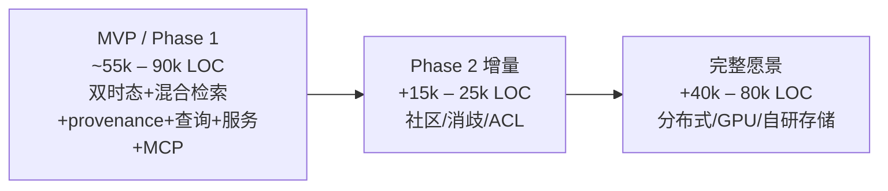
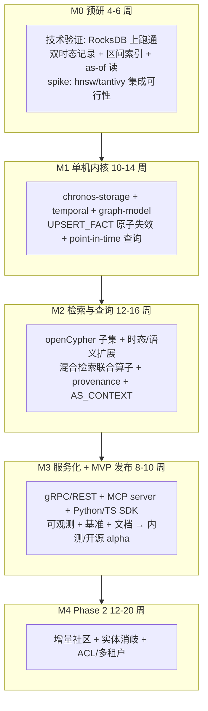

# 双时态图数据库:代码骨架 / 代码量评估 / 工程化落地计划

> 配套文档,基于 [`graph-db-for-rag-design.md`](/Users/jimmy/graph-db-for-rag-design.md)。本文给出可直接落地的工程视图:技术栈决策、仓库与模块骨架(含关键 trait 桩代码)、分模块代码量(LOC)评估、以及分阶段的工程化落地计划。
>
> 项目代号:**Chronos-Graph**(下文简称 Chronos)。

---

## 0. 技术栈决策

选型空间在设计文档第 6 节已论证,这里给出落地层面的具体取舍。

- **实现语言:Rust**。理由:数据库内核需要可控内存 + 无 GC 抖动 + 高并发;生态成熟(RocksDB/tantivy/hnsw/tonic);FFI 友好,便于做 Python/TS 客户端与嵌入式形态。对手中 FalkorDB 是 C、Kùzu 是 C++,Rust 在安全性与开发效率上更优。
- **存储底座:RocksDB(`rust-rocksdb`)起步**。理由:append-heavy 的双时态写入与 LSM 天然契合(设计文档 6.1);先复用成熟 LSM,把精力投到双时态记录格式 + 区间索引 + MVCC 语义,而非自研 LSM。预留 trait 边界,后续可替换为自研引擎。
- **向量索引:`hnsw_rs` / `instant-distance`** 起步,封装在 `VectorIndex` trait 后,支持分段构建 + 后台合并。
- **全文/BM25:`tantivy`**(Rust 原生倒排,生产级)。
- **查询语言:openCypher 子集**,自研词法/语法(`logos` + 手写递归下降 / `chumsky`),扩展 `AS OF ... TIME` / `SIMILAR` / `TRAVERSE SEMANTIC` / `CONTEXT` 算子。
- **服务层:`tonic`(gRPC)+ `axum`(HTTP/REST)+ `tokio`**;MCP server 以 stdio/HTTP 暴露。
- **客户端 SDK:Python(`pyo3` 或 gRPC stub)+ TypeScript(gRPC-web / REST)**。
- **可观测:`tracing` + Prometheus exporter**。

---

## 1. 代码骨架(Cargo workspace)

### 1.1 仓库目录树

```text
chronos-graph/
├── Cargo.toml                      # workspace root
├── README.md
├── rust-toolchain.toml
├── crates/
│   ├── chronos-common/             # 共享类型: Id, Time, Error, 配置
│   ├── chronos-storage/            # 存储引擎: 双时态记录格式 + RocksDB 封装 + MVCC
│   │   ├── src/
│   │   │   ├── codec.rs            # 记录序列化(边四元时间戳 / 节点)
│   │   │   ├── engine.rs           # KV/LSM 抽象 (trait StorageEngine)
│   │   │   ├── rocks.rs            # RocksDB 实现
│   │   │   ├── mvcc.rs             # 多版本 + 快照
│   │   │   ├── txn.rs              # 事务 / WAL
│   │   │   └── interval_index.rs   # 双时态区间索引
│   ├── chronos-graph-model/        # 图模型: 节点/边/属性/三层子图(episode/entity/community)
│   ├── chronos-index/              # 二级索引聚合层
│   │   ├── src/
│   │   │   ├── vector.rs           # trait VectorIndex + HNSW 实现
│   │   │   ├── fulltext.rs         # trait FullTextIndex + tantivy 实现
│   │   │   └── manager.rs          # 索引生命周期 / 嵌入重算
│   ├── chronos-temporal/           # 双时态核心: 有效期/失效/point-in-time 语义
│   │   ├── src/
│   │   │   ├── bitemporal.rs       # ValidTime / TxTime 区间逻辑
│   │   │   ├── invalidation.rs     # 矛盾检测 + 失效(UPSERT_FACT 语义)
│   │   │   └── as_of.rs            # point-in-time 查询求值
│   ├── chronos-provenance/         # triple↔chunk↔doc 内置链路 + 来源失效级联
│   ├── chronos-query/              # 查询语言与执行
│   │   ├── src/
│   │   │   ├── lexer.rs            # 词法 (logos)
│   │   │   ├── parser.rs           # openCypher 子集 + 时态/语义扩展
│   │   │   ├── ast.rs
│   │   │   ├── logical_plan.rs     # 逻辑计划
│   │   │   ├── optimizer.rs        # 规则 + 代价模型(混合检索打分)
│   │   │   ├── physical_plan.rs    # 物理算子
│   │   │   └── executor/
│   │   │       ├── traversal.rs    # BFS / 语义加权遍历
│   │   │       ├── hybrid.rs       # 向量+BM25+图 联合排序
│   │   │       ├── upsert_fact.rs  # 原子失效写入算子
│   │   │       ├── budget.rs       # SELECT_SUBGRAPH token 预算选择
│   │   │       └── context.rs      # AS_CONTEXT graph-to-text 序列化
│   ├── chronos-community/          # [Phase 2] Leiden + 增量社区物化视图 + 摘要
│   ├── chronos-resolution/         # [Phase 2] 嵌入式实体消歧/归并
│   ├── chronos-server/             # gRPC/HTTP 服务, 会话, ACL, 多租户
│   │   ├── src/
│   │   │   ├── grpc.rs
│   │   │   ├── rest.rs
│   │   │   ├── session.rs
│   │   │   └── acl.rs              # [Phase 2] 权限下推
│   ├── chronos-mcp/                # 内置 MCP server(Agent 工具: 写记忆/检索/多跳)
│   └── chronos-embedded/           # 嵌入式库形态(单机/边缘), 复用同一内核
├── sdks/
│   ├── python/                     # pyo3 或 gRPC stub
│   └── typescript/
├── benches/                        # criterion 基准 + RAG 检索质量评测
├── tests/                          # 集成测试 / 端到端
└── tools/
    ├── loadgen/                    # 写入/查询负载生成
    └── ingest-cli/                 # 抽取流水线(外置 LLM)对接
```

### 1.2 关键 trait / 接口桩代码

下面是定义系统边界的核心接口(Rust),可直接作为起点。注释只标注非显然的约束。

#### 双时态类型与记录(`chronos-temporal` / `chronos-storage`)

```rust
/// 现实时间线 T 与事务时间线 T' 的四元时间戳。失效=关闭区间而非删除。
pub struct BitemporalSpan {
    pub valid_from: Timestamp,
    pub valid_to: Option<Timestamp>,   // None = 至今有效
    pub tx_from: Timestamp,
    pub tx_to: Option<Timestamp>,      // None = 当前事务版本
}

pub struct Fact {
    pub id: EdgeId,
    pub subject: NodeId,
    pub predicate: PredicateId,
    pub object: NodeId,
    pub span: BitemporalSpan,
    pub provenance: ProvenanceRef,     // 指向 chunk/doc
    pub embedding: Option<VectorId>,
}

/// point-in-time 求值: 给定 (valid_t, tx_t) 返回当时可见的事实视图。
pub trait AsOfResolver {
    fn resolve(&self, valid_t: Timestamp, tx_t: Timestamp, q: &Query) -> Result<FactView>;
}
```

#### 存储引擎抽象(`chronos-storage`)

```rust
pub trait StorageEngine: Send + Sync {
    fn begin(&self) -> Result<Txn>;
    fn get(&self, txn: &Txn, key: &Key) -> Result<Option<Bytes>>;
    fn put(&self, txn: &mut Txn, key: Key, val: Bytes) -> Result<()>;
    fn scan(&self, txn: &Txn, range: KeyRange) -> Result<RecordIter>;
    fn snapshot(&self) -> Result<Snapshot>;   // MVCC 一致读
}

/// 双时态区间索引: 按 valid/tx 区间高效定位活跃事实, 避免全表属性过滤。
pub trait IntervalIndex {
    fn insert(&mut self, span: &BitemporalSpan, id: EdgeId) -> Result<()>;
    fn close(&mut self, id: EdgeId, at: Timestamp) -> Result<()>;     // 失效
    fn query_active(&self, valid_t: Timestamp, tx_t: Timestamp) -> Result<Vec<EdgeId>>;
}
```

#### 索引(`chronos-index`)

```rust
pub trait VectorIndex: Send + Sync {
    fn add(&mut self, id: VectorId, v: &[f32]) -> Result<()>;
    fn search(&self, q: &[f32], k: usize, filter: &Filter) -> Result<Vec<(VectorId, f32)>>;
    fn rebuild_segment(&mut self) -> Result<()>;   // 高写入下的分段合并
}

pub trait FullTextIndex: Send + Sync {
    fn index(&mut self, id: DocId, text: &str) -> Result<()>;
    fn search_bm25(&self, q: &str, k: usize) -> Result<Vec<(DocId, f32)>>;
}
```

#### 混合检索代价模型与联合算子(`chronos-query::executor::hybrid`)

```rust
/// 统一打分: 向量 + BM25 + 结构 + 新鲜度 + 时间有效性, 单算子联合排序。
pub struct HybridScorer {
    pub w_vec: f32, pub w_bm25: f32, pub w_struct: f32,
    pub w_recency: f32, pub w_validity: f32,
}

pub trait RetrievalOperator {
    /// 服务端多跳: 向量/全文/语义遍历联合执行, 在 token 预算内返回子图。
    fn retrieve(&self, q: &CompiledQuery, budget: TokenBudget, at: AsOf)
        -> Result<Subgraph>;
}

/// 矛盾检测 + 失效旧事实 + 写入新事实, 引擎事务内原子完成。
pub trait FactWriter {
    fn upsert_fact(&self, txn: &mut Txn, fact: Fact, policy: ConflictPolicy)
        -> Result<UpsertOutcome>;
}
```

#### 子图序列化与 Agent 接口(`chronos-query::executor::context` / `chronos-mcp`)

```rust
pub trait ContextSerializer {
    /// 去重 + 线性化 + 带引用标记 → LLM-ready 文本
    fn as_context(&self, sg: &Subgraph, cite: bool) -> Result<ContextBlock>;
}

/// MCP 工具: 暴露给 Agent 的写记忆 / 检索 / 多跳能力
pub trait McpTools {
    fn add_memory(&self, episode: Episode) -> Result<()>;
    fn search_memory(&self, q: &str, budget: TokenBudget, at: AsOf) -> Result<ContextBlock>;
}
```

---

## 2. 代码量评估(LOC)

估算口径:**含单元测试,不含第三方依赖与自动生成代码**;按 Rust 习惯("生产代码 : 测试" 约 1 : 0.4)。范围分三档:**MVP(P1)**、**Phase 2**、**完整愿景**。

### 2.1 分模块明细(生产代码 + 测试,单位:LOC)

- `chronos-common`:1,000 – 1,500(类型/错误/配置,基础但分散)
- `chronos-storage`:6,000 – 9,000(记录编解码 2k + RocksDB 封装 2k + MVCC/事务 2.5k + 区间索引 2.5k)。注:复用 RocksDB 省去自研 LSM 的 15k+。
- `chronos-graph-model`:2,500 – 4,000(节点/边/属性/三层子图)
- `chronos-temporal`:3,500 – 5,500(双时态语义 + 失效/矛盾消解 + as-of 求值,**核心难点,测试占比高**)
- `chronos-index`:3,000 – 5,000(向量 1.5k + 全文 1.5k + 生命周期/重算 2k,主要是集成与过滤下推)
- `chronos-provenance`:1,500 – 2,500
- `chronos-query`:**18,000 – 30,000**(全项目最大块)
  - 词法/语法/AST:3k – 5k
  - 逻辑/物理计划 + 优化器(含代价模型):6k – 10k
  - 执行算子(遍历/hybrid/upsert/budget/context):8k – 14k
- `chronos-server`:4,000 – 7,000(gRPC + REST + 会话 + 多租户)
- `chronos-mcp`:1,500 – 2,500
- `chronos-embedded`:1,500 – 2,500(共享内核的薄封装)
- SDKs(Python + TS):4,000 – 7,000
- benches/tests/tools:6,000 – 10,000

### 2.2 Phase 2 增量模块

- `chronos-community`(Leiden + 增量物化视图 + 摘要调度):6,000 – 10,000(增量一致性是难点)
- `chronos-resolution`(嵌入式实体消歧 + 归并后历史/provenance 一致性维护):4,000 – 7,000
- `chronos-server::acl`(权限下推到联合执行):2,500 – 4,000
- GPU 协同 / 自研 LSM 替换 / 分布式分片:**完整愿景档,各 10k – 25k+**

### 2.3 汇总



- **MVP / Phase 1 总计:约 55,000 – 90,000 LOC**(中位约 70k)。
- **到 Phase 2 可用产品:约 70,000 – 115,000 LOC**。
- **完整愿景:约 110,000 – 195,000 LOC**。

对标参照:Kùzu(C++)主体在数十万 LOC 量级、FalkorDB 内核(C)约数万 LOC;Chronos 复用 RocksDB/tantivy/hnsw,把自研集中在双时态与查询执行,MVP 落在 7 万行量级是合理的。**`chronos-query` 与 `chronos-storage`+`chronos-temporal` 合计约占 MVP 的 55–60%,是投入与风险的重心。**

---

## 3. 工程化落地计划

### 3.1 阶段划分与里程碑



各里程碑的"完成定义(DoD)":

- **M0**:能在 RocksDB 上写入带 `BitemporalSpan` 的事实并用区间索引做 `AS OF` 读;hnsw/tantivy spike 跑通,确认依赖可用。**产出:技术验证报告 + 性能基线**。
- **M1**:`UPSERT_FACT` 在单事务内完成"检测矛盾→失效旧事实→写新事实";point-in-time 查询正确(双时间线)。**DoD:双时态语义有完整属性测试 + 崩溃恢复测试通过**。
- **M2**:能用扩展 Cypher 跑 `MATCH ... AS OF VALID TIME ... TRAVERSE SEMANTIC(...) RETURN CONTEXT(cite=true)`;混合检索单次调用联合排序;结果自带引用。**DoD:端到端"问→带引用的上下文"打通,延迟达标(亚秒级单跳)**。
- **M3**:服务端 + MCP + 双 SDK + 基准;对接一个真实 RAG/Agent demo。**DoD:外部用户可通过 SDK/MCP 接入,有 quickstart 与基准数据 → 发布 alpha**。
- **M4**:增量社区物化视图(局部重算)、实体消歧、多租户 ACL 下推。

总周期约 **11–15 个月** 到 Phase 2 可用产品。

### 3.2 团队与人力

- **存储/事务工程师 × 1–2**:`chronos-storage` / `temporal` / MVCC(资深 Rust + 数据库背景)。
- **查询引擎工程师 × 2**:`chronos-query`(解析/优化/执行,最大块)。
- **检索/索引工程师 × 1**:向量/全文/混合打分/AS_CONTEXT。
- **平台/服务工程师 × 1**:server/MCP/SDK/可观测/CI。
- **(Phase 2)算法工程师 × 1**:社区检测 + 实体消歧。
- 合计 **5–7 人**,核心 4 人即可启动 M0–M1。

### 3.3 CI / 工程基础设施

- **CI 流水线**(GitHub Actions/类似):`cargo fmt --check` + `clippy -D warnings` + `cargo test` + `cargo deny`(依赖/许可证审计)。
- **基准回归**:`criterion` 微基准 + 每日大基准(写入吞吐、单跳/多跳延迟、point-in-time 查询),结果入库做**性能回归门禁**。
- **正确性**:双时态语义用 **property-based testing**(`proptest`)+ 模型对照(参考实现);存储层 **崩溃恢复 / 故障注入** 测试。
- **检索质量评测**:建一套 RAG 评测集(可借鉴 Zep 论文用的 Agent 记忆评测口径),量化召回/答案准确率,纳入 M2/M3 验收。
- **发布**:语义化版本 + 预编译二进制 + Docker 镜像 + crates/PyPI/npm 发布。

### 3.4 关键技术风险与缓解(承接设计文档 8.3)

- **查询引擎工作量最大、最易超期**:M2 拆成"先跑通固定算子管线(无优化器)→ 再加代价优化器"两步交付,降低一次性风险。
- **双时态 + 混合检索 + ACL 联合执行复杂度**:MVP 不做 ACL,联合执行先做双时态+混合两路,正确性用 property test 兜底。
- **HNSW 高写入增量成本**:M1 即引入分段构建 + 后台合并,M0 spike 先量化重建开销。
- **增量社区一致性**:Phase 2 起步用"标脏 + 异步弱一致重算",不阻塞写入路径。
- **依赖锁定(RocksDB)**:用 `StorageEngine` trait 隔离,保留后续替换自研引擎的空间。
- **生态采用**:openCypher 兼容 + Graphiti 后端适配层(让现有 Graphiti 用户可把 Chronos 当作高性能后端)作为冷启动抓手。

### 3.5 冷启动产品策略(降低采用门槛)

- 先做 **Graphiti 兼容后端**:实现 Graphiti 期望的图操作接口,让 Graphiti 用户零改动换上 Chronos,直接获得引擎级双时态/混合检索收益——以此获取早期真实负载与反馈。
- 再以 **MCP server + 双时态 Cypher** 吸引直接构建 Agent 记忆的新用户。

---

### 附:与设计文档的对应关系

- 痛点 P1/P3 → `chronos-temporal`、`chronos-resolution`
- 痛点 P4 → `chronos-provenance`
- 痛点 P5/P6 → `chronos-query::executor::{hybrid, traversal}`
- 痛点 P7 → `chronos-community`
- 痛点 P8 → `chronos-query::executor::{budget, context}`
- 痛点 P9 → `chronos-server::acl`
- MVP 范围(设计文档 8.1:P1+P5+P4)对应 M1+M2。
